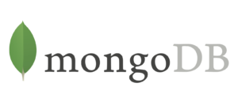

# 1. Get started

**Documentation Platform**: https://www.mongodb.com/docs/

- **Create an account**: https://www.mongodb.com/docs/atlas/tutorial/create-atlas-account/

- **Sign up to mongoDB university**: https://learn.mongodb.com/

- **Select the learning path:** https://learn.mongodb.com/pages/certification-program

  This selection can be based on industry or tech; for my context I made the decision based on tech, and I chose the Python learning path, it aligns with my long-term goal of learning how to utilise Python across a wide range of applications https://learn.mongodb.com/learn/learning-path/mongodb-python-developer-path 

  - Node.js
  - **Python**
  - Java
  - php

- **Student discount:** https://education.github.com/discount_requests/application; you should be able to provide proof of enrolment in a university acceptance letter or valid student card.

# 2. MongoDB Atlas

**Overview URL:** https://cloud.mongodb.com

